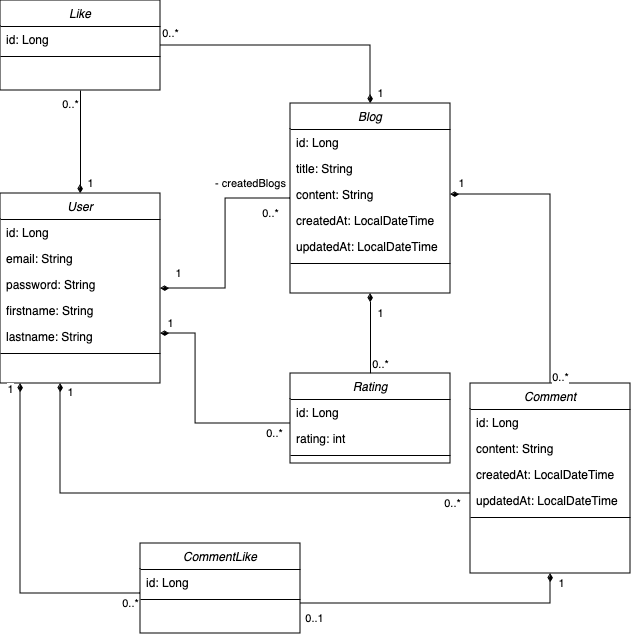

# IN306 - Verteilte System (Blog Project)

## What does this application do?
This Blog Application is built using Quarkus and provides a simple REST API for managing blog posts. The application allows users to:
- **Retrieve all blog posts**: Users can fetch a list of all blog posts available in the system
- **Retrieve a single blog post**: Users can retrieve a specific blog post by its unique identifier.
- **Add new blog posts**: Users can create and add new blog posts to the system.
- **Manage users**: Users can register, login, and manage their accounts. 
- **Comment on blog posts**: Users can comment on blog posts and view comments on each post. 
- **Like blog posts**: Users can like blog posts to show appreciation or agreement with the content. 
- **Reply to comments**: Users can reply to comments on blog posts, facilitating discussions and interactions. 
- **Rate blog posts**: Users can rate blog posts based on their quality or relevance.

## Project Structure
The project follows a standard Quarkus structure:

```
├── java
│   └── ch
│       └── hftm
│           └── blog
│               ├── boundry
│               │   ├── BlogResource.java
│               │   └── CommentResource.java
│               ├── entity
│               │   ├── Blog.java
│               │   ├── BlogLike.java
│               │   ├── Comment.java
│               │   ├── CommentLike.java
│               │   ├── Rating.java
│               │   └── User.java
│               ├── repository
│               │   ├── BlogLikeRepository.java
│               │   ├── BlogRepository.java
│               │   ├── CommentLikeRepository.java
│               │   ├── CommentRepository.java
│               │   ├── RatingRepository.java
│               │   └── UserRepository.java
│               └── service
│                   ├── BlogService.java
│                   ├── CommentService.java
│                   └── UserService.java
└── resources
    └── application.properties
    

└── resources
    ├── Blog Insert.sql
    ├── Blog.drawio.png
    ├── User Insert.sql
    └── in306-blog.yaml

```
- **boundary**: Contains REST resource classes responsible for handling HTTP requests.
- **service**: Service class containing business logic for blogs operations.
- **repository**: Repository class for database operations.
- **entity**: Entity class representing various components of this application.
- **application.properties**: Configuration file for database and other settings.

## Entity classes

- **User:** Represents a user with basic account details and a profile picture.
- **Blog:** Stores blog posts created by users with titles, content, creation/update timestamps, associated user, comments, likes, and ratings.
- **Comment:** Represents comments on blog posts with content, creation/update timestamps, associated blog, user, and likes.
- **Like:** Tracks likes on blog posts by users.
- **CommentLikes:** Tracks likes on comments by users.
- **Rating:** Stores numeric ratings (e.g., 1-5 stars) given by users to blog posts.

## How to Start the Project

### Prerequisites
- Ensure you have JDK 11 or later installed.
- Make sure you have Maven installed.

### Steps to Start the Project
1. **Clone the Repository**:
   ```sh
   git clone https://github.com/hamsiHftm/IN306-Blog-Project.git
   cd IN306-Blog-Project
   ```

2. **Configure the Database**:
TODO


3. **Run the Application**:
   Use Maven to start the application:
   ```sh
   ./mvnw quarkus:dev
   ```

   The application will be available at `http://localhost:8080`.


## Change History
1. **Project created**: Initial project setup.
2. **Blog Model**: Added the Blog model class.
3. **DB Connection (repository and service)**: Implemented database connection, repository, and service layers for blog.
4. **Project structure**: Defined the overall project structure.
5. **REST API paths added**: Added REST API endpoints for blog operations.
6. **Entity**: I tried adding a new entity, but it didn't work. I need help fixing this or removing the entity entirely.
7. **Entities**: All entity classes have been added for the project. 
8. **OpenAPI**: An OpenAPI specification has been added to the resources folder, but it is not yet complete. Due to time constraints, I was unable to finish it.
This README provides a comprehensive overview of the blog application, including its functionality, project structure, additional classes, ideas for future enhancements, and instructions for setting up and running the application.
9. **Blog HTTP requests**: Implemented PUT, POST, GET, and DELETE routes for the Blog entity.
10. **Error-Response**: Added thorough error handling in the way responses are managed.
11. **Validation**: Validation added for entities.
12. **User Repository**: Necessary User Repository added.
13. **CreateBlogRequestDTO Schema:** Schema for creating blog request added
14. **Schema improved**: Schema for get all blogs added
15. **application.properties**: Property file updated for DB data
16. **User HTTP requests**: Http Route fully implemented for user model with schema